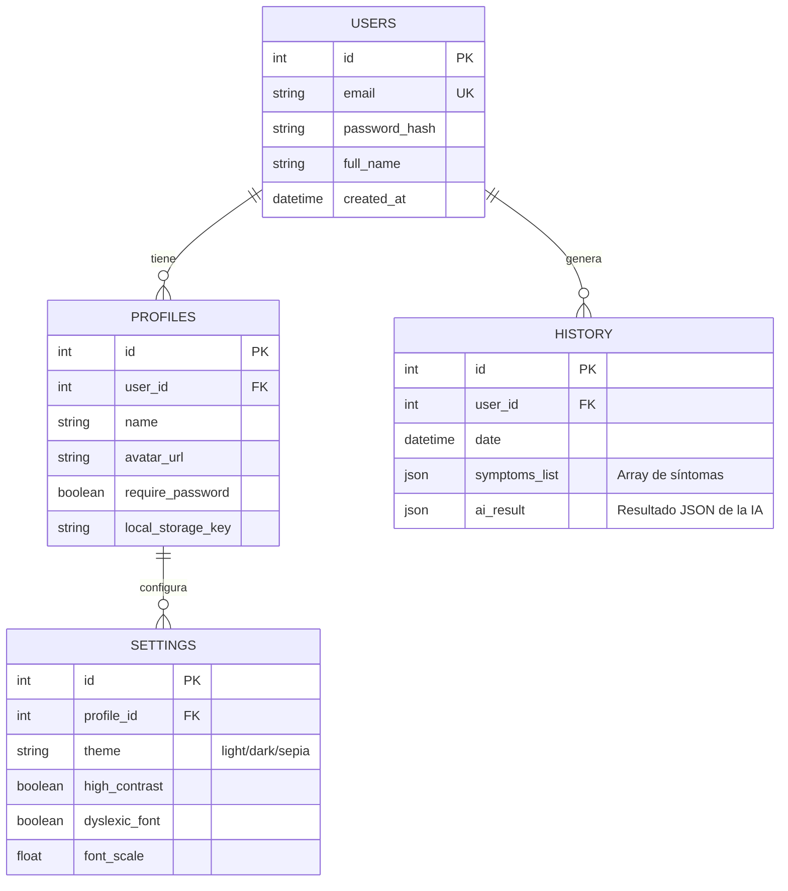

# INFORME DEL SISTEMA: SaludAsist

## 1. INDICACIONES GENERALES

*   Debe documentar todos los formularios ya desarrollados.
*   Así como la propuesta de formularios por realizar, es decir más formularios por estudiante que destaquen el proceso de información en base al tema proyecto que será aprobado por el docente.
*   Luego cada formulario será evaluado su interfaz por el usuario mediante pruebas de usabilidad aplicando ISO 9241-11 e ISO/EC 25010 dados en plantillas funcionales.
*   Y las pruebas de las diversas opciones del menú de accesibilidad.
*   Con la realización de dos pruebas funcionales al prototipo del sistema en días planificados.

## 2. EXPLICACION DEL SISTEMA

**SaludAsist** es una Plataforma de Pre-diagnóstico Médico Asistido que utiliza Inteligencia Artificial para evaluar síntomas y proporcionar orientaciones de salud preliminares.

**Funcionamiento de la IA en el proyecto:**
La IA actúa como el núcleo del módulo de "Diagnóstico". El usuario interactúa con el sistema de dos formas principales para alimentar a la IA:
1.  **Cuestionario Guiado:** El sistema presenta preguntas binarias (Sí/No) sobre síntomas críticos ("Red Flags") y comunes.
2.  **Entrada de Lenguaje Natural:** El usuario describe sus síntomas escribiendo o usando **dictado por voz**.

**Proceso:**
El motor de IA recibe estos datos no estructurados (texto de síntomas) y estructurados (respuestas del cuestionario). Utiliza algoritmos de Procesamiento de Lenguaje Natural (NLP) para identificar entidades médicas (síntomas, duración, gravedad) y las cruza con una base de conocimiento médico probabilística.

**Resultado:**
El sistema devuelve un conjunto de posibles condiciones ordenadas por probabilidad (confianza), junto con recomendaciones de acción inmediata (ej. "Acudir a urgencias", "Pedir cita", "Cuidados en casa").

## 3. MODELOS IA

**PROYECTO SISTEMA:** SaludAsist (Pre-diagnóstico Médico)

| Entrada datos (Tablas, Web, Archivos, Variables) | Proceso IA (En base al documento, C3-Normativa-legislacion, pagina. 1) | Salida datos (formato datos) |
| :--- | :--- | :--- |
| **Variables de Entrada:** - Lista de síntomas (Array string) - Respuestas Cuestionario (Boolean) - Datos demográficos (Edad, Sexo - *Perfil*) | **1. Normalización:** Convertir texto libre (ej. "me duele la chola") a términos médicos estandarizados (ej. "cefalea"). **2. Inferencia:** Algoritmo de clasificación probabilística que compara el vector de síntomas con patrones de enfermedades conocidas. **3. Filtrado de Seguridad:** Detección prioritaria de "Red Flags" (síntomas de emergencia). | **Objeto JSON de Respuesta:** - `diagnoses`: Lista de condiciones. &nbsp;&nbsp;- `condition`: Nombre (String) &nbsp;&nbsp;- `confidence`: % Probabilidad (Float) &nbsp;&nbsp;- `recommendation`: Consejo (String) - `urgency`: Nivel de triaje (Alto/Medio/Bajo) |

## 4. FORMULARIOS YA DESARROLLADOS

**TEMA DEL SISTEMA:** SaludAsist - Módulo de Paciente

**USUARIO:** Paciente / Usuario General

| Nombre Formulario | Descripción del formulario | Desarrollador por |
| :--- | :--- | :--- |
| **UserSelectionPage** | Pantalla de selección de perfiles tipo "Netflix". Permite elegir usuario, agregar nuevos y gestionar el acceso rápido. | Equipo de Desarrollo |
| **LoginPage / RegisterPage** | Formularios de autenticación segura. Incluye validación de credenciales y opción de "Recordar contraseña". | Equipo de Desarrollo |
| **Layout / Dashboard (Inicio)** | Pantalla principal con diseño "Glassmorphism". Muestra accesos directos, consejos rápidos y resumen de actividad. | Equipo de Desarrollo |
| **GuidedQuestions** | Cuestionario interactivo de preguntas Sí/No para filtrar síntomas comunes y señales de alerta antes del diagnóstico libre. | Equipo de Desarrollo |
| **SymptomForm** | Formulario de entrada de síntomas con capacidad de **Dictado por Voz** (Speech-to-Text) y gestión de lista de síntomas. | Equipo de Desarrollo |
| **Results (Diagnóstico)** | Pantalla de visualización de resultados de la IA. Muestra tarjetas con las condiciones detectadas y barras de confianza. | Equipo de Desarrollo |
| **ProfilePage** | Gestión de datos del usuario y configuración de seguridad (activar/desactivar contraseña para inicio rápido). | Equipo de Desarrollo |
| **HistoryPage** | Listado cronológico de diagnósticos anteriores con opción de revisar detalles pasados. | Equipo de Desarrollo |
| **AccessibilityMenu** | Panel flotante de configuración de accesibilidad (Tamaño texto, Contraste, Dislexia, Pausa animaciones). | Equipo de Desarrollo |

## 5. PROPUESTAS DE FORMULARIOS CON EL MODELO IA

**TEMA DEL SISTEMA:** SaludAsist - Expansión Funcional

**USUARIO:** Paciente

| Nombre Formulario | Descripción del formulario | Desarrollador por |
| :--- | :--- | :--- |
| **Chatbot Médico Asistente** | Interfaz conversacional tipo chat donde la IA hace preguntas de seguimiento dinámicas basadas en las respuestas anteriores del usuario para afinar el diagnóstico. | *Propuesta Estudiante 1* |
| **Análisis de Imágenes Dermatológicas** | Formulario que permite subir una foto de una afección en la piel. La IA (Visión Computacional) analiza la imagen para detectar posibles problemas dermatológicos. | *Propuesta Estudiante 2* |
| **Predicción de Citas y Especialistas** | Formulario que, basado en el diagnóstico obtenido, sugiere automáticamente la especialidad médica requerida y busca disponibilidad en calendarios de doctores simulados. | *Propuesta Estudiante 3* |

## 6. DIAGRAMA MODELO RELACIONAL BASE DATOS

A continuación se describe el esquema relacional que soporta la aplicación:

**Descripción de Tablas:**

1.  **USERS:** Almacena las credenciales principales y la identidad legal del usuario.
2.  **PROFILES:** Permite múltiples perfiles bajo una misma cuenta (ej. Padre, Madre, Hijo), cada uno con su avatar y preferencias de seguridad local.
3.  **HISTORY:** Registro histórico de cada consulta realizada a la IA. Almacena tanto los síntomas ingresados (`symptoms_list`) como la respuesta completa de la IA (`ai_result`) para consulta futura.
4.  **SETTINGS:** Guarda las preferencias de accesibilidad y visualización específicas de cada perfil, asegurando que la experiencia se adapte a las necesidades (ej. dislexia) de cada persona.

